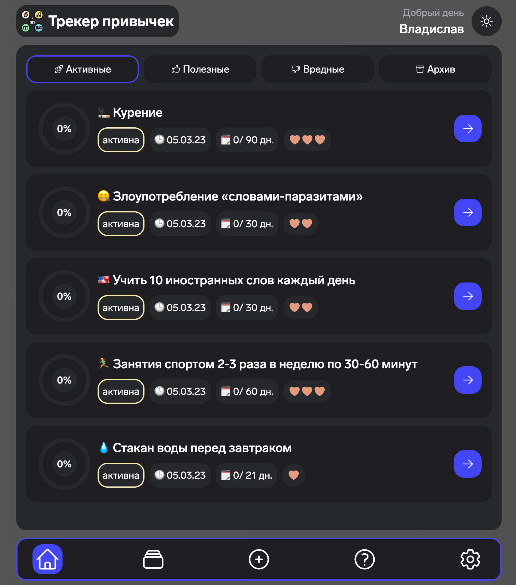

# 🎯 Habits Tracker

### Full-stack development demonstration project

### For all questions and suggestions, you can contact here:

- telegram: https://t.me/kvvprof
- email: kvv.prof@gmail.com

## 👉 Demo: https://habits-tracker.ru

## 😛 Language

TypeScript

## 🖥 Frontend (client)

Stack: react, tailwindcss, ky, zustand, react-query, react-hook-form, react-router-dom

## 📦 Backend (api)

Stack: nestjs, prisma, passport-jwt, swagger, nodemailer, handlebars, bcrypt

## 📚 Database

PostgreSQL

## 🔑 Authentication

JWT authentication with two tokens: access token and refresh token. Access token is stored in the application's memory. Refresh token is stored in cookie.

## 🌍 Deploy

Stack: docker, docker compose, nginx, certbot, vds by selectel

Docker compose services:

- client (nginx + react build => [https://habits-tracker.ru/]())
- api (nodejs + nestjs build => [https://habits-tracker.ru/api/swagger]())
- postgres (PostgreSQL database)
- adminer (adminer => [https://habits-tracker.ru/adminer]())
- proxy (nginx)
- certbot (certbot)

## ❤️ Thank you for taking the time to view this project!
