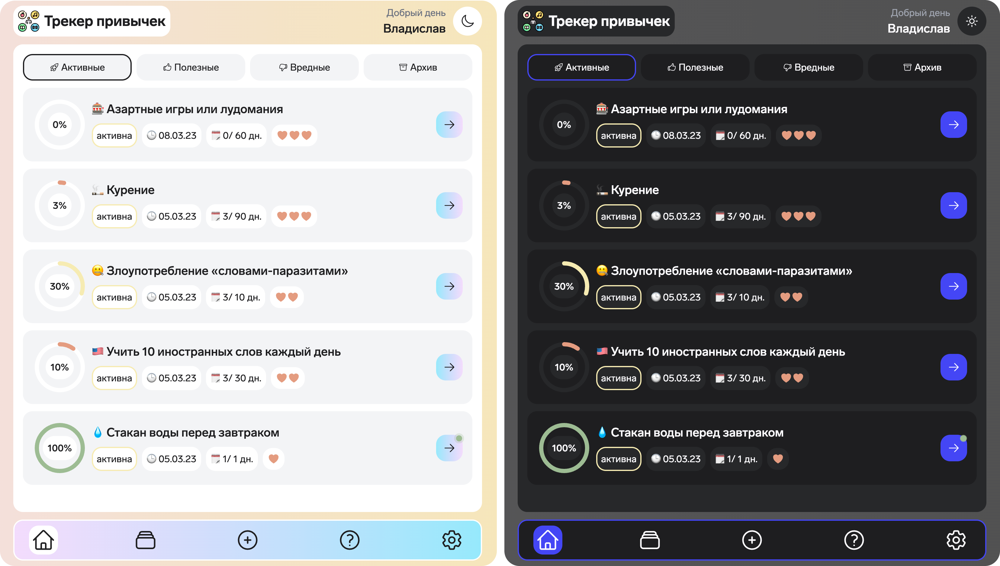

# 🎯 Habits Tracker

### Full-stack development demonstration project

### For all questions and suggestions, you can contact here:

- telegram: [https://t.me/kvvprof](https://t.me/kvvprof)
- email: [kvv.prof@gmail.com](kvv.prof@gmail.com)

 

## 👉 Demo: [https://habits-tracker.ru](https://habits-tracker.ru)

 

## 😛 Language

TypeScript

 

## 🖥 Frontend (client)

Stack: react, tailwindcss, ky, zustand, react-query, react-hook-form, react-router-dom

 

## 📦 Backend (api)

Stack: nestjs, prisma, passport-jwt, swagger, nodemailer, handlebars, bcrypt

 

## 📚 Database

PostgreSQL

 

## 🔑 Authentication

JWT authentication with two tokens: access token and refresh token. Access token is stored in the application's memory. Refresh token is stored in cookie.

 

## 🌍 Deploy

Stack: docker, docker compose, nginx, certbot, vds by selectel

Docker compose services:

- **client**: nginx + react build => [https://habits-tracker.ru/](https://habits-tracker.ru/)
- **api**: nodejs + nestjs build => [https://habits-tracker.ru/api/swagger](https://habits-tracker.ru/api/swagger)
- **postgres**: PostgreSQL database
- **adminer**: adminer => [https://habits-tracker.ru/adminer](https://habits-tracker.ru/adminer)
- **proxy**: nginx
- **certbot**: certbot

 

## ❤️ Thank you for taking the time to view this project!
